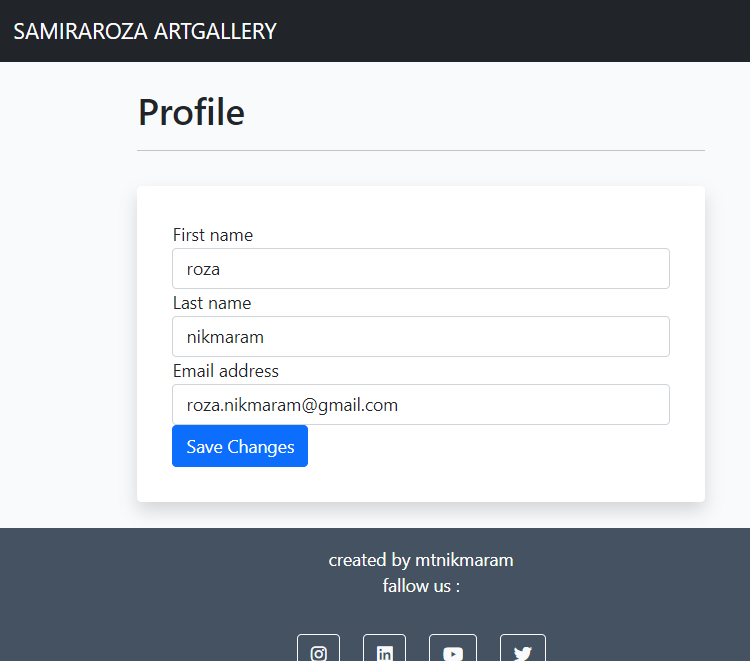

<h1> SAMIRAROZA ART GALLERY </h1>
<p> This is a art gallery blog from my wife's works . I am proud to announced that all of the paintings in this blog is painted by my wife and i hope you enjoy visiting the blog. </p>


[View live website here](https://artgallery-qrot.onrender.com)


# Table of Content

* [**Project**](<#project>)
    * [Site Users Goal](<#site-users-goal>)
    * [Site Owners Goal](<#site-owners-goal>)
    
* [**User Experience (UX)**](<#user-experience-ux>)
    * [User Stories](<#user-stories>)
    * [Site Structure](<#site-structure>)
   

* [**Existing Features**](<#existing-features>)
    * [Navigation](<#navigation>)
    * [Create post](<#create-post>)
    * [View my posts](<#viewmypost>)
    * [Profile Page](<#profile-page>)
    * [Sign Up](<#sign-up>)
    * [Sign In](<#sign-in>)
    * [Sign Out](<#sign-out>)
    * [Footer](<#footer>)
    

* [**Features Left To Implement**](<#features-left-to-implement>)

* [**Technologies Used**](<#technologies-used>)
    * [Languages](<#languages>)
    * [Frameworks & Software](<#frameworks--software>)
    * [Libraries](<#libraries>)

* [**Testing**](<#testing>)
    * [Testing User Stories](<#testing-user-stories>)
    * [Code Validation](<#code-validation>)
    * [Additional Testing](<#additional-testing>)
    * [Manual Testing](<#manual-testing>)
    * [Known Bugs](<#known-bugs>)

* [Deployment](<#deployment>)
* [Credits](<#credits>)
* [Acknowledgements](<#acknowledgements>)

# **project**

## Site User Goal
This site is created that users can enjoy watching beautiful painting.

## Site Owner Goal
This project is about painting . The most reason is to share my wife's works to public.

# **User Experience (UX)**

## User Stories
Below i have listed the user stories which is matters.

## Site User
// As a site user I can //
* I can view a list of the paintings 
* I can sign in to see more
* I can select the one that i want to see
* I can like the post and comment on it
* I can see the other likes and comments 
* I can navigate easy on the site through paginated list of posts so that I feel comfortable
* I can view comments on a specific post so that I can read the conversations between different users on the site
* I can sign up an account so that I can like and comment on post, create a profile page, create own post and edit / remove my post
* I can create a profile page so that other users can read about who I am 
* I can comment on a post so that I can be involved in the conversation 
* I can edit my comment so that I can change the content if needed 
* I can remove my post so that I have full control of my post 
* I can choose to see my own post so that I can find them easily
* I can create a new post so that I can contribute to with new content to post  
* I can log out from the site so that I can feel safe that nobody can access my information 
* I can create draft post so that I can finish writing the content later 
* I can get visual feedback when interacting with the content so that I can be sure how I have interacted with the page 

## Site Admin

* I can log out from the site so that I can feel safe that nobody can access my information .
* I can create, read, update and delete posts so that I can manage my post content .
* I can approve posts so that I can secure high quality of the content .
* I can approve and disapprove comments so that I can secure a safe environment for the Site Users .
* I can create draft posts so that I can finish writing the content later .
* I can get visual feedback when interacting with the content so that I can be sure how I have interacted with the page .

[Back to top](<#table-of-content>)

## Site Structure

The samiraroza artgallery is split up in two parts: **when the user is logged out** and **when the user is logged in**. Depending on login status different pages is available for the user. When the user is logged out the pages: *home* are available. When the user is logged in *create a post*, *view my post* and *show profile page* are available.

Read more about the different choices in the [Features](<#features>) section.

[Back to top](<#table-of-content>)

# **Features**
The features of the site are listed below.

## **Existing Features**

### **Navigation**
The navigation bar is very clean and straight forward. Depending if you  are logged in or not different menus are visible for the site user

*Links that are visible to logged out users*

* home - you can use it to go the home page.
* Login / Sign Up - Gives the user the opportunity to log in or sign up if not ready a registered user at samiraroza artgallery.
 

*Links that are visible to logged in users*

All of the links that are visible to a not logged in user plus the ones below.

* Create a post - Lets the user create a new post.
* View My post - Lists all post created by the logged in user.
* Show Profile Page - Shows logged in users profile page.
* Log Out - Logs out the user.
 

### **Create post**
On this page the registered and logged in user can create their own post. When they have sent it in samiraroza artgallery needs to approve it, until it's approved it will not be visible for the public.

### **View My Post**
on this page user can view the post that have created

### **Profile Page**
On this page the user can view and update their own profile page. 


### **Sign Up**
If the site visitor has no registered user at samiraroza artgallery they can sign up. They can also add a presentation and upload a featured image that will be used on the users profile page.


### **Sign In**
On this page the user can sign in to samiraroza artgallery


### **Sign Out**
When the user clicks sign out in the menu bar a confirmation page is being showed so that the user don't accidentally sign out.


### **Footer**
The footer area includes short information about samiraroza artgallery, contact information and links to relevant social media.


[Back to top](<#table-of-content>)

### **Features Left To Implement**
I like to change the blog to shopping page so users can buy the paintings.
I will add a shopping basket and a credit card to the page.

# **Technologies Used**

## **Languages**

* [Python](https://en.wikipedia.org/wiki/Python_(programming_language)) - Provides the functionality for the site.
* [HTML5](https://en.wikipedia.org/wiki/HTML) - Provides the content and structure for the website.
* [CSS3](https://en.wikipedia.org/wiki/CSS) - Provides the styling for the website.
* [JavaScript](https://en.wikipedia.org/wiki/JavaScript) - Provides interactive elements of the website

## **Frameworks & Software**
* [Bootstrap](https://getbootstrap.com/) - A CSS framework that helps building solid, responsive, mobile-first sites
* [Django](https://www.djangoproject.com/) - A model-view-template framework used to create the samiraroza artgallery site
* [Github](https://github.com/) - Used to host and edit the website.
* [Heroku](https://en.wikipedia.org/wiki/Heroku) - A cloud platform that the application is deployed to.
* [Lighthouse](https://developer.chrome.com/docs/lighthouse/overview/) - Used to test performance of site.
* [Responsive Design Checker](https://www.responsivedesignchecker.com/) - Used for responsiveness check.
* [Favicon](https://favicon.io/) - Used to create the favicon.
* [VSCode](https://code.visualstudio.com/) - Used to create and edit the site.
* [Cloudinary](https://cloudinary.com/) - A service that hosts all static files in the project.
* [HTML Validation](https://validator.w3.org/) - Used to validate HTML code
* [CSS Validation](https://jigsaw.w3.org/css-validator/) - Used to validate CSS code
* [PEP8 Validation](http://pep8online.com/) - At the time for deploying this project the PEP8 Online Validation service was offline, therefore not used.
* [JSHint Validation](https://jshint.com/) - Used to validate JavaScript code


## **Libraries**

[Back to top](<#table-of-content>)

The libraries used in this project are located in the requirements.txt file and have been documented below

* [asgiref](https://pypi.org/project/asgiref/) - ASGI is a standard for Python asynchronous web apps and servers to communicate with each other, and positioned as an asynchronous successor to WSGI.
* [cloudinary](https://pypi.org/project/cloudinary/) - The Cloudinary Python SDK allows you to quickly and easily integrate your application with Cloudinary. Effortlessly optimize, transform, upload and manage your cloud's assets.
* [dj3-cloudinary-storage](https://pypi.org/project/dj3-cloudinary-storage/) - Django Cloudinary Storage is a Django package that facilitates integration with Cloudinary by implementing Django Storage API.
* [Django](https://pypi.org/project/Django/) - Django is a high-level Python web framework that encourages rapid development and clean, pragmatic design.
* [django-allauth](https://pypi.org/project/django-allauth/) - Integrated set of Django applications addressing authentication, registration, account management as well as 3rd party (social) account authentication.
* [django-crispy-forms](https://pypi.org/project/django-crispy-forms/) - Used to integrate Django DRY forms in the project.
* [django-extensions](https://pypi.org/project/django-extensions/) - Django Extensions is a collection of custom extensions for the Django Framework.
* [gunicorn](https://pypi.org/project/gunicorn/) - Gunicorn ‘Green Unicorn’ is a Python WSGI HTTP Server for UNIX. It’s a pre-fork worker model ported from Ruby’s Unicorn project. The Gunicorn server is broadly compatible with various web frameworks, simply implemented, light on server resource usage, and fairly speedy.
* [oauthlib](https://pypi.org/project/oauthlib/) - OAuthLib is a framework which implements the logic of OAuth1 or OAuth2 without assuming a specific HTTP request object or web framework.
* [psycopg2](https://pypi.org/project/psycopg2/) - Psycopg is the most popular PostgreSQL database adapter for the Python programming language.

[Back to top](<#table-of-content>)

# **Testing**

## Testing User Stories

* As a Site User : I can view a list of the post so that I can select one to read
    
* As a Site User : I can click on a specific post so that I can read it in detail
   
* As a Site User : I can like and unlike a post so that it is possible for me to interact with the post
    * When the user is logged it is possible to click on a heart on the post detail page to like / unlike a post.

* As a Site User : I can view the number of likes on each post so that I can see how popular a specific post is
    * On the post detail page the user can see how many likes the specific post has.

* As a Site User : I can contact post artgallery in an easy way so that I can interact with them if I have a need for it
    * In the footer there is clear information about how to contact artgallery.

* As a Site User : I can navigate easy on the site through paginated list of posts so that I feel comfortable using the site
    * On the post pages the pagination is activated when there are more than 6 posts on a page.

* As a Site User : I can view comments on a specific post so that I can read the conversations between different users on the site
    * When the user clicks on a specific post the comment section can, in an easily way, be viewed.

* As a Site User : I can sign up an account so that I can like and comment on posts, create a profile page, create own posts and edit / remove my posts
    * In the navigation bar the user can click the Login / Sign up link to either login or sign up for a new account. When this is done the user can interact on the page as stated in the user story.

* As a Site User : I can create a profile page so that other posters can read about who I am
    * If a user is registered and logged in there is a 'Show Profile'-page in the navigation menu where the user can fill in profile details. The profile is shown for the site users in the about section.

* As a Site User : I can comment on a post so that I can be involved in the conversation
    * When the user is logged in they can write a comment on a specific post on the post detail page.

* As a Site User : I can edit my comment so that I can change the content if needed
    * When the user is logged in an edit button appears on the all comments that the specific user has written. When the user clicks the edit button they can change the content in the comment.

* As a Site User : I can remove my post so that I have full control of my posts
    * When the user is logged in a delete button appears on the all comments that the specific user has written. When the user clicks the delete button they get the option to delete the comment.

* As a Site User : I can choose to see my own posts so that I can find them easily
    * When a user is logged in they can choose to view their own posts through the link 'My posts'.

* As a Site User : I can create a new post so that I can contribute to with new content to post 
    * When a user is logged in they can create a new post through the 'Create New post'-link in the navigation bar.

* As a Site User : I can log out from the site so that I can feel safe that nobody can access my information
    * When the user is logged in it is possible to choose the 'Log Out'-option in the navigation menu.

* As a Site User : I can create draft posts so that I can finish writing the content later
    * When a logged in user creates a post they have the possibility to set the status on the post either on published or draft.

* As a Site User : I can get visual feedback when interacting with the content so that I can be sure how I have interacted with the page
    * When the user sign in, sign out, create / update / deletes posts and comments they always get a confirmation message to secure visual feedback.

* As a Site Admin : I can log out from the site so that I can feel safe that nobody can access my information
   * When the admin is logged in it is possible to choose the 'Log Out'-option in the navigation menu.

* As a Site Admin : I can create, read, update and delete posts so that I can manage my post content
   
* As a Site Admin : I can approve posts so that I can secure high quality of the content
    
* As a Site Admin : I can approve and disapprove comments so that I can secure a safe environment for the Site Users
    
* As a Site Admin : I can create draft posts so that I can finish writing the content later

* As a Site Admin : I can get visual feedback when interacting with the content so that I can be sure how I have interacted with the page
   
## **Code Validation**

The code on the 'samiraroza artgallery' site has been tested through W3C Markup Validation Service, W3C CSS Validation Service and JSHint. Errors were at first found on the site in the W3C Markup Validation Service but could quite easily be fixed (see bugs section). One error appeared as well in the W3C CSS Validation but that was connected to Font Awesome and not to the site code itself (see bugs section).

### **Markup Validation**
After fixing the initial errors that W3C Markup Validation Service reported, no errors were returned.


### **CSS Validation**
When validating my own code the W3C CSS Validator reports no errors.


### **PEP Validation**
At the time of this project the website [pep8online](http://pep8online.com/) is currently offline. Usually I'm using that site to validate my Python code. Due to the site being offline I have followed Code Institutes workaround to add the PEP8 validator 'pycodestyle' to the Gitpod Workspace. I have tested the following Python files:

* admin.py - No errors or warnings reported
* forms.py - No errors or warnings reported
* models.py - No errors or warnings reported
* test_forms.py - No errors or warnings reported
* urls.py - No errors or warnings reported
* views.py - No errors or warnings reported

### **JavaScript Validation**
The JSHint validator results can be seen below:

No errors were returned when passing through JSHint (script.js) but the test reported one undefined variable connected to Bootstrap which is no problem.


[Back to top](<#table-of-content>)

## **Additional Testing**

### **Responsiveness Test**
The responsive design tests were carried out manually with [Google Chrome DevTools](https://developer.chrome.com/docs/devtools/) and [Responsive Design Checker](https://www.responsivedesignchecker.com/).

| Desktop    | Display <1280px       | Display >1280px    |
|------------|-----------------------|--------------------|
| Render     | pass                  | pass               |
| Images     | pass                  | pass               |
| Links      | pass                  | pass               |

| Tablet     | Samsung Galaxy Tab 10 | Amazon Kindle Fire | iPad Mini | iPad Pro |
|------------|-----------------------|--------------------|-----------|----------|
| Render     | pass                  | pass               | pass      | pass     |
| Images     | pass                  | pass               | pass      | pass     |
| Links      | pass                  | pass               | pass      | pass     |

| Phone      | Galaxy S5/S6/S7       | iPhone 6/7/8       | iPhone 12pro         |
|------------|-----------------------|--------------------|----------------------|
| Render     | pass                  | pass               | pass      | pass     |
| Images     | pass                  | pass               | pass      | pass     |
| Links      | pass                  | pass               | pass      | pass     |

### **Browser Compatibility**
* Google Chrome 
* Mozilla Firefox
* Apple Safari
* Microsoft Edge


### **Lighthouse**
Google Lighthouse in Chrome Developer Tools was used to test the application 


### Manual Testing

In addition to tests stated above I have performed a series of manual tests. Below is a list of tests that have been conducted. These test are in addition to checking against acceptance criteria of each user story and fulfilling all of the relevant tasks.

**Main Website - User Logged Out**

 * Typing in a incorrect URL on the page loads the 404 error page
 * Clicking the nav logo loads the home page
 * Clicking the Home button on the nav bar loads the home page
 * Clicking the Contact Us button on the nav bar lists takes the user to the contact us page
 * Clicking the Log In / Sign Up loads the sign in/sign up page
 * Clicking the Instagram link in the footer area opens Instagram in a new window
 * Clicking the YouTube link in the footer area opens YouTube in a new window
 * Clicking the LinkedIn link in the footer area opens LinkedIN in a new window
 * Clicking the Twitter link in the footer area opens Twitter in a new window
 
**Main Website - User Logged In**

 * Typing in a incorrect URL on the page loads the 404 error page
 * The user can add/edit/delete their post.
 * The user can add/edit/delete their contact information.
 * The user can add/edit/delete their profile information.
 * The user is informed by a message appearing at the top of the screen about each add/edit/delete action.
 

**Create A User Profile - User Logged Out**

 * First name is required and has to contain must not contain numbers or special characters outside of the commonly used characters.
 * Last name is required and has to contain must not contain numbers or special characters outside of the commonly used characters.
 * The email is required and must be the email format.


# **Known bugs**
No known bugs besides those in the fixed / unfixed bugs section.

### **Fixed Bugs**
The most massive bug was error 404 , and error 500 
This error was very hard to be fixed but by searching the web and seeing the other work i finally got the knowledge to fix the issues 
* Crispy filter now working/not being applied: I had copied the allauth templates into templates/allauth/templates instead of templates/allauth, so the crispy filter and other changes could not be applied.
* True or False: I changed values from false/true and back in some my models and the migrations failed
* When the site was deployed, the css or the images would not show/be applied :I used absolute paths for the css file and the images/icons. I had to remove the first slash.
* The favicon was not loading properly: I had to move the favicon.ico file to the static folder and update the path in base.html
* Lines > 80, other minor errors: I had to cut then in pieces or leave then like that

# **Deployment**

## **Deployment To Heroku**

The project was deployed to [Heroku](https://www.heroku.com). To deploy, please follow the process below:

1. To begin with we need to create a GitHub repository from the [Code Institute template](https://github.com/Code-Institute-Org/gitpod-full-template) by following the link and then click 'Use this template'.


2. Fill in the needed details and then click 'Create Repository From Template'.


3. When the repository creation is done click 'code' so i can get the code to my vscode.


4. Now it's time to install Django and the supporting libraries that are needed. Type the commands below to do this.

* ```pip3 install 'django<4' gunicorn```
* ```pip3 install 'dj_database_url psycopg2```
* ```pip3 install 'dj3-cloudinary-storage```


5. When Django and the libraries are installed we need to create a requirements file.

* ```pip3 freeze --local > requirements.txt``` - This will create and add required libraries to requirements.txt


6. Now it's time to create the project.

* ```django-admin startproject YOUR_PROJECT_NAME .``` - This will create your project


7. When the project is created we can now create the application.

* ```python3 manage.py startapp APP_NAME``` - This will create your application


8. We now need to add the application to settings.py


9. Now it is time to do our first migration and run the server to test that everything works as expected. This is done by writing the commands below.

* ```python3 manage.py migrate``` - This will migrate the changes
* ```python3 manage.py runserver``` - This runs the server. To test it, click the open browser button that will be visible after the command is run.

10. Now it is time to create our application on Heroku, attach a database, prepare our environment and settings.py file and setup the Cloudinary storage for our static and media files.

* Head on to [Heroku](https://www.heroku.com/) and sign in (or create an account if needed).

* In the top right corner there is a button that is labeled 'New'. Click that and then select 'Create new app'.


11. Now it's time to enter an application name that needs to be unique. When you have chosen the name, choose your region and click 'Create app".


12. Go to the settings tab and click on the reveal Config Vars button. Copy the text from DATABASE_URL (because we are going to need it in the next step).


13. Go back to vscode and create a new env.py in the top level directory. Then add these rows.

* ```import os``` - This imports the os library
* ```os.environ["DATABASE_URL_FROM HEROKU"]``` - This sets the environment variables.
* ```os.environ["SECRET_KEY"]``` - Here you can choose whatever secret key you want.


14. Now we are going to head back to Heroku to add our secret key to config vars. 


15. Now we have some preparations to do connected to our environment and settings.py file. In the settings.py, add the following code:

```import os```

```import dj_database_url```

```if os.path.isfile("env.py"):```

```import env```


16. In the settings file, remove the insecure secret key and replace it with:
```SECRET_KEY = os.environ.get('SECRET_KEY')```


17. Now we need to comment out the old database setting in the settings.py file (this is because we are going to use the postgres database instead of the sqlite3 database).


18. Save all your fields and migrate the changes.

```python3 manage.py migrate```

19. Now we are going to get our connection to Cloudinary connection working (this is were we will store our static files). First you need to create a Cloudinary account and from the Cloudinary dashboard copy the API Environment Variable.

20. Go back to the env.py file in Gitpod and add the Cloudinary url (it's very important that the url is correct):

```os.environ["CLOUDINARY_URL"] = "cloudinary://************************"```

21. Let's head back to Heroku and add the Cloudinary url in Config Vars. We also need to add a disable collectstatic variable to get our first deployment to Heroku to work.


22. Let's head back to our settings.py file on Gitpod. We now need to add our Cloudinary Libraries we installed earlier to the installed apps. Here it is important to get the order correct.


23. For Django to be able to understand how to use and where to store static files we need to add some extra rows to the settings.py file.


24. Let's change the templates directory to TEMPLATES_DIR in the templates array.


25. To be able to get the application to work through Heroku we also need to add our Heroku app and localhost to which hosts that are allowed.


26. Now we just need to add some files to vscode.

* Create 3 folders in the top level directory: **media**, **static**, **templates**
* Create a file called **Procfile* and add the line ```web: gunicorn PROJ_NAME.wsgi?``` to it.

27 Now you can save all the files and prepare for the first commit and push to Github by writing the lines below.

* ```git add .```
* ```git commit -m "Deployment Commit```
* ```git push```


28. Before moving on to the Heroku deployment we just need to add one more thing in the config vars. We need to add "PORT" in the KEY input field and "8000" in the VALUE field. If we don't add this there might be problems with the deployment.


29. Now it's time for deployment. Scroll to the top of the settings page in Heroku and click the 'Deploy' tab. For deployment method, select 'Github'. Search for the repository name you want to deploy and then click connect.


30. Scroll down to the manual deployment section and click 'Deploy Branch'. Hopefully the deployment is successful!

## How To Fork The Repository On GitHub

It is possible to do a independent copy of a GitHub Repository by forking the GitHub account. The copy can then be viewed and it is also possible to do changes in the copy without affecting the original repository. To fork the repository, take these steps:

1. After logging in to GitHub, locate the repository. On the top right side of the page there is a 'Fork' button. Click on the button to create a copy of the original repository.

## Cloning And Setting Up This Project**

To clone and set up this project you need to follow the steps below.

1. When you are in the repository, find the code tab and click it.
2. To the left of the green GitPod button, press the 'code' menu. There you will find a link to the repository. Click on the clipboard icon to copy the URL.
3. Use an IDE and open Git Bash. Change directory to the location where you want the cloned directory to be made.
4. Type 'git clone', and then paste the URL that you copied from GitHub. Press enter and a local clone will be created.
5. To be able to get the project to work you need to install the requirements. This can be done by using the command below:

* ```pip3 install -r requirements.txt``` - This command downloads and install all required dependencies that is stated in the requirements file.

6. The next step is to set up the environment file so that the project knows what variables that needs to be used for it to work. Environment variables are usually hidden due to sensitive information. It's very important that you don't push the env.py file to Github (this can be secured by adding env.py to the .gitignore-file). The variables that are declared in the env.py file needs to be added to the Heroku config vars. Don't forget to do necessary migrations before trying to run the server.

* ```python3 manage.py migrate``` - This will do the necessary migrations.
* ```python3 manage.py runserver``` - If everything i setup correctly the project is now live locally.


# **Credits**

## **Content**

* All text content written by mtnikmaram.
* All the images are my wife's work
* Template for readme provided by Code Institute 
## Technical

* Inspiration regarding CSS code to add circle around text [How to Add a Circle Around a Number in CSS](https://www.w3docs.com/snippets/css/how-to-add-a-circle-around-a-number-in-css.html)

* Inspiration regarding adding extra forms in Django Allauth form [How to add more custom fields on signup form?](https://stackoverflow.com/questions/68591755/django-allauth-how-to-add-more-custom-fields-on-signup-form)

# Acknowledgements
The site was completed as a Portfolio 4 Project piece for the Full Stack Software Developer (e-Commerce) Diploma at the [Code Institute](https://codeinstitute.net/). As such I would like to thank my mentor [Precious Ijege](https://www.linkedin.com/in/precious-ijege-908a00168/), the Slack community, and all at the Code Institute for their help and support. 


[Back to top](<#table-of-content>)